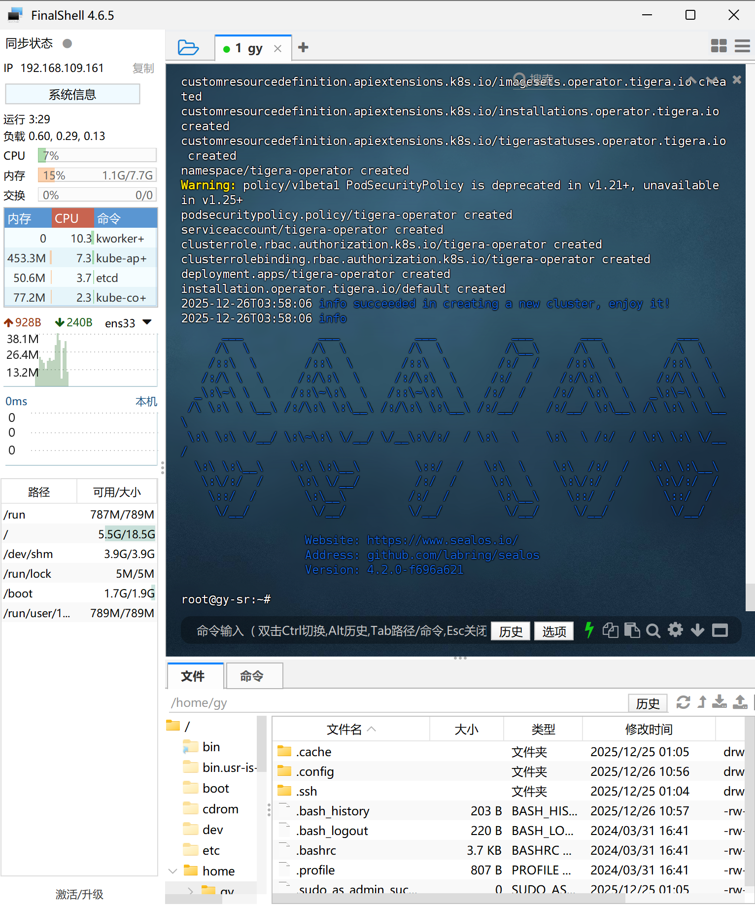
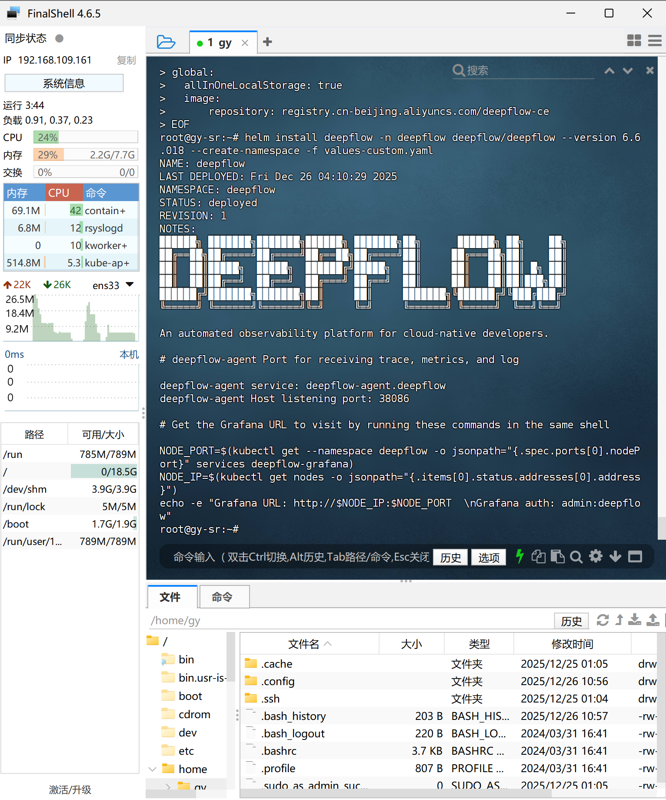
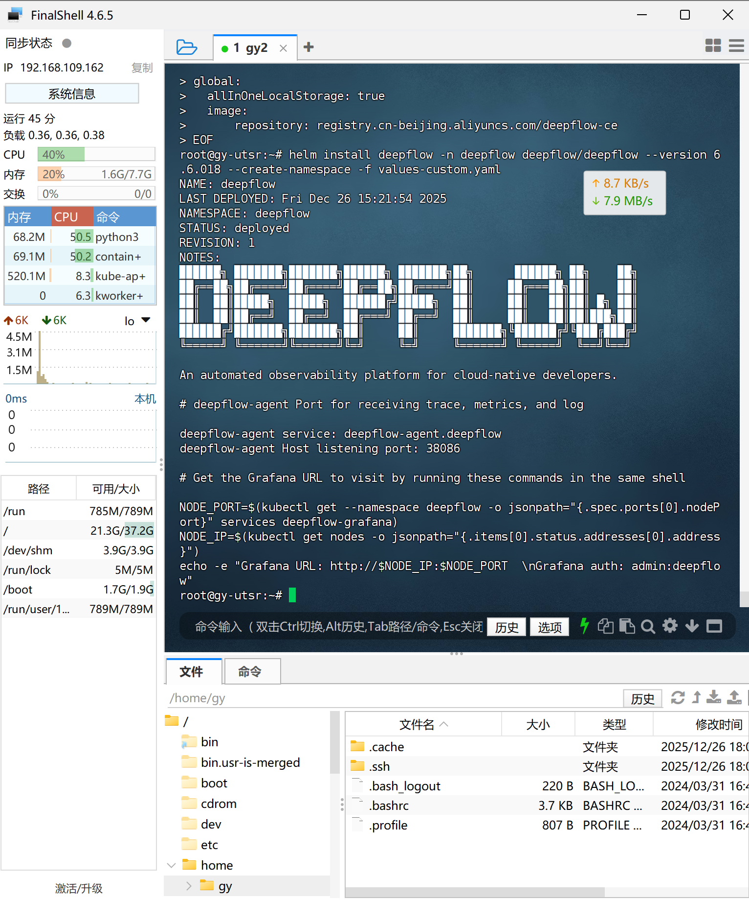
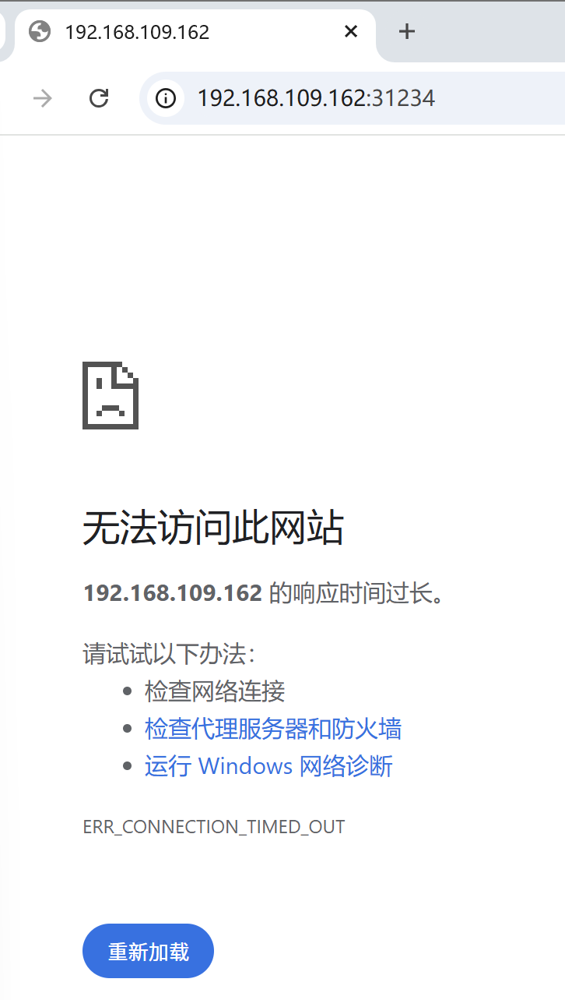
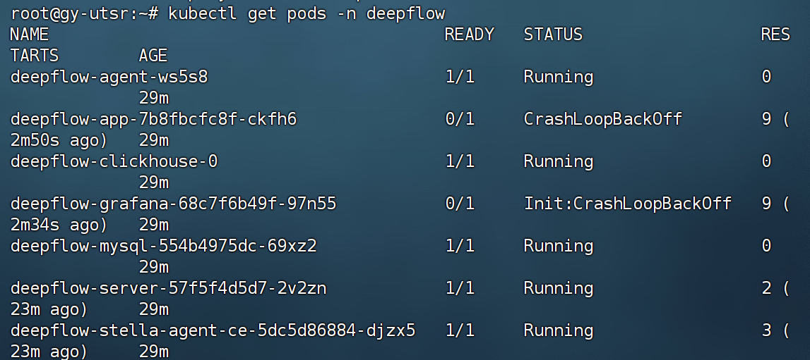
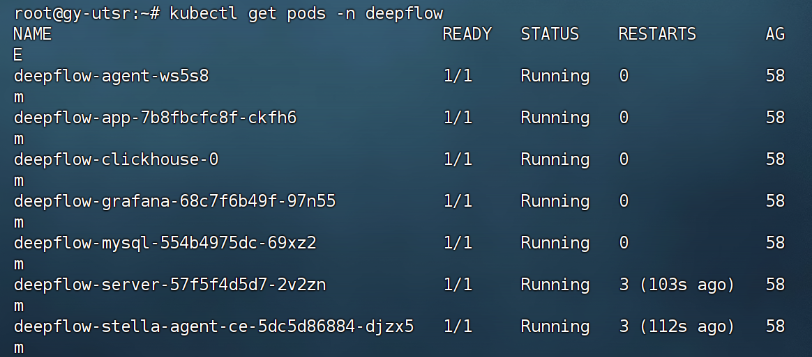
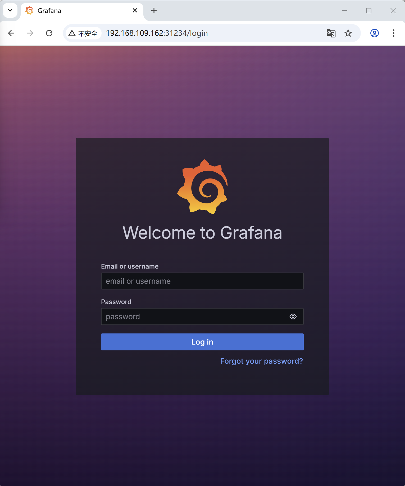

## 0 文献

### 0.1 K8s

- [Kubernetes](https://kubernetes.io/zh-cn/)

- Kubernetes发音：`/ˌkjuːbəˈnetɪs/`

### 0.2 Deepflow

[云原生-可观测性-零侵扰采集-全栈可观测-分布式追踪-eBPF-Wasm-DeepFlow可观测性平台](https://www.deepflow.io/zh/)

## 1 安装

### 1.1 使用Ubuntu Desktop【已弃用】

#### 1.1.1 部署 All-in-One K8s

[All-in-One 快速部署](https://www.deepflow.io/docs/zh/ce-install/all-in-one/)

环境：4C8G的Ubuntu24.04

```bash
# 未解决权限问题，对原命令进行了优化
sudo sh -c 'curl -o /usr/bin/sealos https://deepflow-ce.oss-cn-beijing.aliyuncs.com/sealos/sealos && chmod +x /usr/bin/sealos'
```

安装并配置 SSH 服务

```bash
# 安装openssh-server
sudo apt install openssh-server -y

# 启动 SSH 服务​
sudo systemctl start ssh

# 设置开机自启（避免重启后服务失效）​
sudo systemctl enable ssh

# 查看 SSH 服务状态（关键验证步骤）​
sudo systemctl status ssh

# 重启 SSH 服务（可能会用到）
sudo systemctl restart ssh
```


使用本地回环地址 `127.0.0.1` 测试 SSH 连接​,注意：这里输入的密码是当前用户（gy）的密码，不是 root 密码​

```bash
gy@gy-VM:~/桌面$ ssh gy@127.0.0.1
The authenticity of host '127.0.0.1 (127.0.0.1)' can't be established.
ED25519 key fingerprint is SHA256:f+PwEUEMOtxOFHCkj2kw/2slJnzI1UP9zXUo5h+Pgj8.
This key is not known by any other names.
Are you sure you want to continue connecting (yes/no/[fingerprint])? 
```

输入`yes`就行
之后的登录成功界面是

```bash
gy@gy-VM:~/桌面$ ssh gy@127.0.0.1
gy@127.0.0.1's password: 
Welcome to Ubuntu 24.04.3 LTS (GNU/Linux 6.14.0-37-generic x86_64)

 * Documentation:  https://help.ubuntu.com
 * Management:     https://landscape.canonical.com
 * Support:        https://ubuntu.com/pro

扩展安全维护（ESM）Applications 未启用。

0 更新可以立即应用。

启用 ESM Apps 来获取未来的额外安全更新
请参见 https://ubuntu.com/esm 或者运行: sudo pro status

Last login: Wed Dec 24 15:20:27 2025 from 127.0.0.1
```

```bash
# 使用exit来退出
exit
```

由于Ubuntu 默认在 `/etc/ssh/sshd_config` 中禁止 `root SSH` 登录，需修改配置文件开启该功能：
找到 `#PermitRootLogin prohibit-password`（默认可能有注释符 #），将其修改为 `PermitRootLogin yes`（允许 root 密码登录），我的做法是在此行下面再加一行。

`Esc->:wq`保存退出后，reboot一下Ubuntu，使配置生效
使用毫秒镜像完成，这一点我是根据官网上给出的一下代码，进行了一个类比更改，没想到真的成功了。**注意先看下面两段代码之后的文字。**

```bash
# ⚡ 直接使用（临时）
# 无需配置，直接替换镜像地址即可享受极速下载
# 原来：docker pull nginx:latest (可能很慢或超时)
# 现在：使用毫秒镜像下砸
docker pull docker.1ms.run/nginx:latest
```

```bash
# sealos run labring/kubernetes:v1.24.0 labring/calico:v3.22.1 --masters $IP_ADDR -p $PASSWORD
sudo sealos run docker.1ms.run/labring/kubernetes:v1.24.0 docker.1ms.run/labring/calico:v3.22.1 --masters $IP_ADDR -p $PASSWORD
```

报错，部署失败的关键原因：unable to select an IP from lo network interface（无法从本地回环接口lo选择有效 IP）。
sealos 部署 Kubernetes 时，--masters 参数需指定虚拟机的实际网卡 IP（如192.168.x.x），而当前使用的127.0.0.1是本地回环地址，仅用于本机内部通信，无法作为 Kubernetes 集群的 master 节点 IP（Kubernetes 需要对外提供服务的有效网卡 IP）。

```bash
gy@gy-VM:~/桌面$ sudo sealos run docker.1ms.run/labring/kubernetes:v1.24.0 docker.1ms.run/labring/calico:v3.22.1 --masters $IP_ADDR -p $PASSWORD
2025-12-24T15:53:18 info Start to create a new cluster: master [127.0.0.1], worker [], registry 127.0.0.1

# 中间省略

2025-12-24T15:55:00 error Applied to cluster error: failed to init init master0 failed, error: run command `kubeadm init --config=/root/.sealos/default/etc/kubeadm-init.yaml --skip-certificate-key-print --skip-token-print -v 0 --ignore-preflight-errors=SystemVerification` on 127.0.0.1:22, output: W1224 15:55:00.752788   10785 initconfiguration.go:306] error unmarshaling configuration schema.GroupVersionKind{Group:"kubelet.config.k8s.io", Version:"v1beta1", Kind:"KubeletConfiguration"}: strict decoding error: unknown field "localStorageCapacityIsolation"
W1224 15:55:00.759532   10785 configset.go:177] error unmarshaling configuration schema.GroupVersionKind{Group:"kubelet.config.k8s.io", Version:"v1beta1", Kind:"KubeletConfiguration"}: strict decoding error: unknown field "localStorageCapacityIsolation"
W1224 15:55:00.760347   10785 initconfiguration.go:120] Usage of CRI endpoints without URL scheme is deprecated and can cause kubelet errors in the future. Automatically prepending scheme "unix" to the "criSocket" with value "/run/containerd/containerd.sock". Please update your configuration!
unable to select an IP from lo network interface
To see the stack trace of this error execute with --v=5 or higher
, error: Process exited with status 1,. Please clean and reinstall
Error: failed to init init master0 failed, error: run command `kubeadm init --config=/root/.sealos/default/etc/kubeadm-init.yaml --skip-certificate-key-print --skip-token-print -v 0 --ignore-preflight-errors=SystemVerification` on 127.0.0.1:22, output: W1224 15:55:00.752788   10785 initconfiguration.go:306] error unmarshaling configuration schema.GroupVersionKind{Group:"kubelet.config.k8s.io", Version:"v1beta1", Kind:"KubeletConfiguration"}: strict decoding error: unknown field "localStorageCapacityIsolation"
W1224 15:55:00.759532   10785 configset.go:177] error unmarshaling configuration schema.GroupVersionKind{Group:"kubelet.config.k8s.io", Version:"v1beta1", Kind:"KubeletConfiguration"}: strict decoding error: unknown field "localStorageCapacityIsolation"
W1224 15:55:00.760347   10785 initconfiguration.go:120] Usage of CRI endpoints without URL scheme is deprecated and can cause kubelet errors in the future. Automatically prepending scheme "unix" to the "criSocket" with value "/run/containerd/containerd.sock". Please update your configuration!
unable to select an IP from lo network interface
To see the stack trace of this error execute with --v=5 or higher
, error: Process exited with status 1,. Please clean and reinstall
```

解决办法`先清理→再重新部署`

```bash
# 强制重置集群，清理所有残留
sudo sealos reset -f
# 额外清理 kubeadm 残留（双重保障）
sudo kubeadm reset -f --cri-socket unix:///run/containerd/containerd.sock
# 重启容器运行时（避免 containerd 残留进程影响）
sudo systemctl restart containerd
# 清理 sealos 本地缓存（可选，若重置后仍有问题）
sudo rm -rf /root/.sealos
```

查询ip

```bash
gy@gy-VM:~/桌面$ ip addr | grep inet
    inet 127.0.0.1/8 scope host lo
    inet6 ::1/128 scope host noprefixroute 
    inet 192.168.109.160/24 brd 192.168.109.255 scope global dynamic noprefixroute ens33
    inet6 fe80::20c:29ff:fe60:cda8/64 scope link 

gy@gy-VM:~/桌面$ IP_ADDR="192.168.109.160"

# 再次部署
gy@gy-VM:~/桌面$ sudo sealos run docker.1ms.run/labring/kubernetes:v1.24.0 docker.1ms.run/labring/calico:v3.22.1 --masters $IP_ADDR -p $PASSWORD
```

成功

```bash
gy@gy-VM:~/桌面$ sudo sealos run docker.1ms.run/labring/kubernetes:v1.24.0 docker.1ms.run/labring/calico:v3.22.1 --masters $IP_ADDR -p $PASSWORD
2025-12-24T15:57:32 info Start to create a new cluster: master [192.168.109.160], worker [], registry 192.168.109.160

# 中间省略

2025-12-24T15:58:17 info succeeded in creating a new cluster, enjoy it!
2025-12-24T15:58:17 info 
      ___           ___           ___           ___       ___           ___
     /\  \         /\  \         /\  \         /\__\     /\  \         /\  \
    /::\  \       /::\  \       /::\  \       /:/  /    /::\  \       /::\  \
   /:/\ \  \     /:/\:\  \     /:/\:\  \     /:/  /    /:/\:\  \     /:/\ \  \
  _\:\~\ \  \   /::\~\:\  \   /::\~\:\  \   /:/  /    /:/  \:\  \   _\:\~\ \  \
 /\ \:\ \ \__\ /:/\:\ \:\__\ /:/\:\ \:\__\ /:/__/    /:/__/ \:\__\ /\ \:\ \ \__\
 \:\ \:\ \/__/ \:\~\:\ \/__/ \/__\:\/:/  / \:\  \    \:\  \ /:/  / \:\ \:\ \/__/
  \:\ \:\__\    \:\ \:\__\        \::/  /   \:\  \    \:\  /:/  /   \:\ \:\__\
   \:\/:/  /     \:\ \/__/        /:/  /     \:\  \    \:\/:/  /     \:\/:/  /
    \::/  /       \:\__\         /:/  /       \:\__\    \::/  /       \::/  /
     \/__/         \/__/         \/__/         \/__/     \/__/         \/__/

                  Website: https://www.sealos.io/
                  Address: github.com/labring/sealos
                  Version: 4.2.0-f696a621
```

```bash
# 继续步骤
sudo kubectl taint node node-role.kubernetes.io/master- node-role.kubernetes.io/control-plane- --all
```

#### 1.1.2 安装 Helm

```bash
sudo sh -c 'curl -fsSL -o get_helm.sh https://raw.githubusercontent.com/helm/helm/main/scripts/get-helm-3 && chmod 700 get_helm.sh && ./get_helm.sh'
```

#### 1.1.3 部署 All-in-One DeepFlow

```bash
# 使用root用户
helm repo add deepflow https://deepflow-ce.oss-cn-beijing.aliyuncs.com/chart/stable
helm repo update deepflow # use `helm repo update` when helm < 3.7.0
cat << EOF > values-custom.yaml
global:
  allInOneLocalStorage: true
  image:
      repository: registry.cn-beijing.aliyuncs.com/deepflow-ce
EOF
helm install deepflow -n deepflow deepflow/deepflow --version 6.6.018 --create-namespace -f values-custom.yaml
```

###  1.2 使用Ubuntu Sever

有朋友建议，我部署Deepflow反正也不太需要桌面版，不如使用Sever版本，提高性能。我一想，也对，我反正只用命令行，何故不使用Sever版本呢。

#### 1.2.1 安装sealoa

先进入root用户

```bash
# install sealos
curl -o /usr/bin/sealos https://deepflow-ce.oss-cn-beijing.aliyuncs.com/sealos/sealos && chmod +x /usr/bin/sealos
```

#### 1.2.2 部署 All-in-One K8s

这里的`IP_ADDR`和`PASSWORD`对应的是**当前这台安装了 OpenSSH Server 的 Ubuntu 服务器**（即你正在操作的、IP 为`192.168.109.161`的机器）。

```bash
# install All-in-One kubernetes cluster
IP_ADDR="192.168.109.161"  # FIXME: Your IP address
PASSWORD="asd"       # FIXME: Your SSH root password
sealos run docker.1ms.run/labring/kubernetes:v1.24.0 docker.1ms.run/labring/calico:v3.22.1 --masters $IP_ADDR -p $PASSWORD
```

成功



```bash
# remove kubernetes node taint
kubectl taint node node-role.kubernetes.io/master- node-role.kubernetes.io/control-plane- --all
```

#### 1.2.3 安装 Helm

```bash
curl -fsSL -o get_helm.sh https://raw.githubusercontent.com/helm/helm/main/scripts/get-helm-3
chmod 700 get_helm.sh
./get_helm.sh
```


```bash
helm repo add deepflow https://deepflow-ce.oss-cn-beijing.aliyuncs.com/chart/stable
helm repo update deepflow # use `helm repo update` when helm < 3.7.0
cat << EOF > values-custom.yaml
global:
  allInOneLocalStorage: true
  image:
      repository: registry.cn-beijing.aliyuncs.com/deepflow-ce
EOF
helm install deepflow -n deepflow deepflow/deepflow --version 6.6.018 --create-namespace -f values-custom.yaml
```

成功



#### 1.2.4 访问 Grafana 页面

执行 helm 部署 DeepFlow 时输出的内容提示了获取访问 Grafana 的 URL 和密码的命令，输出示例：

```bash
NODE_PORT=$(kubectl get --namespace deepflow -o jsonpath="{.spec.ports[0].nodePort}" services deepflow-grafana)
NODE_IP=$(kubectl get nodes -o jsonpath="{.items[0].status.addresses[0].address}")
echo -e "Grafana URL: http://$NODE_IP:$NODE_PORT  \nGrafana auth: admin:deepflow"
```

我的输出

```bash
root@gy-sr:~# NODE_PORT=$(kubectl get --namespace deepflow -o jsonpath="{.spec.ports[0].nodePort}" services deepflow-grafana)
root@gy-sr:~# NODE_IP=$(kubectl get nodes -o jsonpath="{.items[0].status.addresses[0].address}")
root@gy-sr:~# echo -e "Grafana URL: http://$NODE_IP:$NODE_PORT  \nGrafana auth: admin:deepflow"
Grafana URL: http://192.168.109.161:32103  
Grafana auth: admin:deepflow
```

#### 1.2.5 地址无法访问及其修复

出了一些bug，我们现在来修复，由于尝试了各种办法，不知道哪个是关键的，所以我们把环境恢复到`访问 Grafana 页面`这一步

OK，到这里创建快照



尝试访问 Grafana 页面

```bash
root@gy-utsr:~# NODE_PORT=$(kubectl get --namespace deepflow -o jsonpath="{.spec.ports[0].nodePort}" services deepflow-grafana)
root@gy-utsr:~# NODE_IP=$(kubectl get nodes -o jsonpath="{.items[0].status.addresses[0].address}")
root@gy-utsr:~# echo -e "Grafana URL: http://$NODE_IP:$NODE_PORT  \nGrafana auth: admin:deepflow"
Grafana URL: http://192.168.109.162:31234  
Grafana auth: admin:deepflow
```

访问失败



开始检查

验证 Grafana 服务的端口与状态

```bash
# 查看 Pod 状态
kubectl get pods -n deepflow
```

过一点时间就可以了，应该是时间问题

刚开始失败



之后多刷新几次就成功了



访问 Grafana 页面，成功好耶



#### 1.2.6 下载 deepflow-ctl

```bash
# 与当前 server 版本同步即可
Version=v6.6

# 使用变量下载
curl -o /usr/bin/deepflow-ctl \
  "https://deepflow-ce.oss-cn-beijing.aliyuncs.com/bin/ctl/$Version/linux/$(arch | sed 's|x86_64|amd64|' | sed 's|aarch64|arm64|')/deepflow-ctl"

# 添加执行权限
chmod a+x /usr/bin/deepflow-ctl
```
