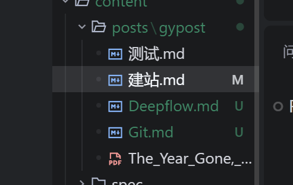

## 1 git命令

```bash
# 初始化本地 Git 仓库，创建 .git 目录跟踪版本
git init

# 绑定本地仓库到远程仓库，origin 为远程仓库别名（需替换为实际仓库地址）
git remote add origin http://.git

# 将本地默认分支名改为 main，适配主流平台分支命名规范
git branch -M main

# 将当前目录下所有文件添加到 Git 暂存区，跟踪文件变更
git add .

# 提交暂存区文件到本地仓库，生成版本记录（备注可替换为有意义的描述）
git commit -m "0"

# 推送本地 main 分支到远程 origin 仓库，并建立分支追踪关系（首次推送需 -u）
git push -u origin main

```

## 2 commit

[约定式提交](https://www.conventionalcommits.org/zh-hans/v1.0.0/)

## last 杂


M和U是Git版本控制系统用于标识文件状态的符号：

- M 表示 Modified（已修改） ：文件已经被修改但尚未提交到Git版本库。例如 建站.md 文件显示为M，说明它已经被修改过。
- U 表示 Untracked（未跟踪） ：文件存在于工作目录中，但尚未被Git跟踪。例如 Deepflow.md 和 Git.md 文件显示为U，说明它们是新创建的文件，Git还没有开始跟踪这些文件的变化。
这些标记帮助开发者了解哪些文件需要被添加到Git跟踪或提交到版本库中。

## 3 Github

### 3.1 把本地的git库覆盖到github仓库

```bash
# 初始化本地仓库（首次操作）
git init
# 添加本地所有文件到暂存区
# 这里会出现warning: in the working copy of 'README.md', LF will be replaced by CRLF the next time Git touches it这样的警告，是 Windows 与 Unix 系统换行符差异导致的正常提示
git add .
# 提交本地更改(xxx为必填)
git commit -m "xxxx"
# 强制推送到 GitHub 远程仓库（main 分支，若为 master 则替换）
git push -f origin main
```

报错

```bash
PS D:\guiyuan1111\CTF\server\Mizuki-master> git push -f origin main
error: src refspec main does not match any
error: failed to push some refs to 'https://github.com/Guiyuan1111/guiyuan1111.github.io.git'
```

分析：因为**本地只有 `master` 分支，无 `main` 分支**。

解决：创建 `main` 分支并推送（适配 GitHub 默认规范）

```bash
# 1. 从 master 分支创建并切换到 main 分支
git checkout -b main

# 2. 强制推送 main 分支到远程
git push -f origin main
```


