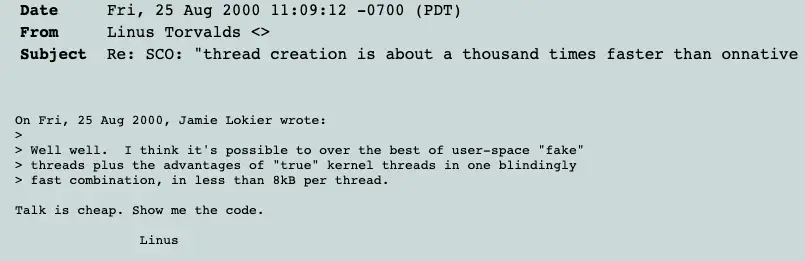
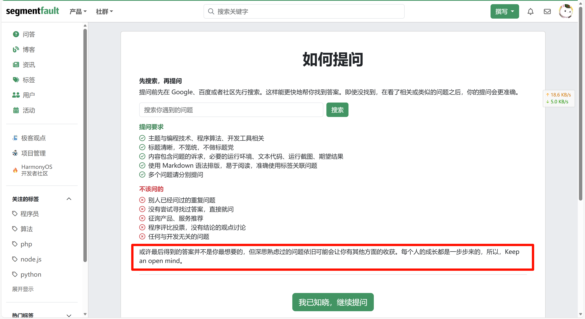

---

title: Talk Is Cheap, Show Me the Code # 标题（需更改）
published: 2025-12-25T1:00:00   # 发表时间（需更改）
pinned: true
description: Linus Torvalds # 描述
tags: # 标签
  - Linux
category: Linux # 分类
licenseName: Unlicensed
author: Guiyuan1111
# sourceLink: https://github.com/emn178/markdown
draft: false
# date: 2025-12-17
# image:./cover.png 
# pubDate: 2025-12-17
permalink: 251225-1
---

## Talk Is Cheap, Show Me the Code

> 空谈无用，代码为凭。

这句话出自 Linux 之父 **Linus Torvalds**，是技术圈的口头禅，核心是强调**用实际代码代替口头争论**。

Linux 的创始人 Linus Torvalds 在 2000-08-25 给linux-kernel 邮件列表的一封邮件提到的：[LKML：Linus Torvalds：关于SCO的说法：“线程创建速度大约比onnative快一千倍](https://lkml.org/lkml/2000/8/25/132)

## Stay hungry Stay foolish

> 求知若饥，虚心若愚

<iframe src="//player.bilibili.com/player.html?isOutside=true&aid=887619345&bvid=BV1qK4y1K7RM&cid=325178086&p=1" scrolling="no" border="0" frameborder="no" framespacing="0" allowfullscreen="true"></iframe>

---

“Stay hungry, Stay foolish” 因乔布斯 2005 年斯坦福大学毕业演讲而全球流传，信达雅的翻译是 “求知若饥，虚心若愚”。

1. **原始出处**：源自 1974 年 10 月停刊的《全球概览》（Whole Earth Catalog）终刊号封底，配图为一条开阔的公路，乔布斯年轻时深受这本杂志影响。
2. **广泛传播**：2005 年 6 月 12 日，乔布斯在斯坦福大学毕业典礼演讲末尾引用此句作为寄语，演讲以 “连接人生的点滴、热爱与失去、死亡” 三个故事展开，这句结尾成为全场高光，迅速成为全球励志格言。

---

上面则一段文字是ai生成的，我本打算留下来，但是听完演讲本身之后，我发现这些内容完全都在演讲之中，写文章有时候很难把自己的思考写出来，而有些时候，恰恰是这选择之间拥有着许多需要参悟的智慧。

《Whole Earth Catalog》：

## You build it, You run it.

> 谁构建，谁运营。

这句话打破了传统开发与运维的壁垒，要求**开发人员不仅要负责代码的编写和部署，还要承担后续的运行维护、故障排查、性能优化等工作**，以此倒逼开发阶段就重视系统的稳定性、可观测性和可维护性。

## Go Big or Go Home

FaceBook 的办公室标语：

> 要么牛逼，要么滚蛋

## Done Is Better Than Perfect

> 完成比完美更重要

这句话的核心是对抗 “完美主义拖延症”，强调**先产出最小可用版本（MVP），再通过迭代优化提升质量**，而非因追求极致而迟迟不行动。

## Eating our own dog food

> 吃自己的狗粮——内部先行试用自研产品

这个说法起源于宠物食品行业（厂商会强调自己员工也会给自家宠物喂同款粮），后来被技术圈借用，核心是**用 “内部用户” 的视角发现产品缺陷**。

## 其他小众

### 保尔·柯察金

当一个代码的工匠回首往事时，不因虚度年华而悔恨，也不因碌碌无为而羞愧，这样，当他老的时候，可以很自豪告诉世人，我曾经将代码注入生命去打造互联网的浪潮之巅，那是个很疯狂的时代，我在一波波的浪潮上留下了或重如泰山或轻如鸿毛的几笔。

### SegmentFault思否

或许最后得到的答案并不是你最想要的，但深思熟虑过的问题依旧可能会让你有其他方面的收获。每个人的成长都是一步步来的，所以，Keep an open mind。

