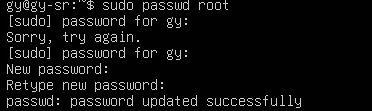
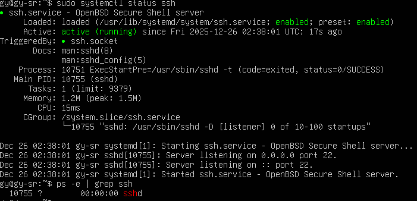
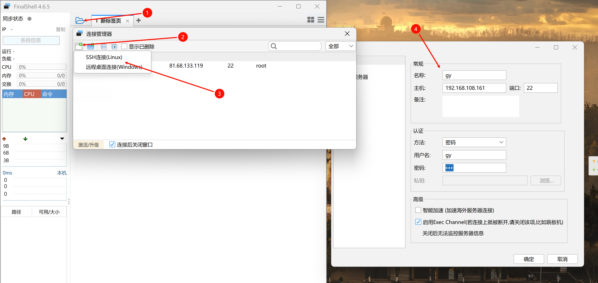
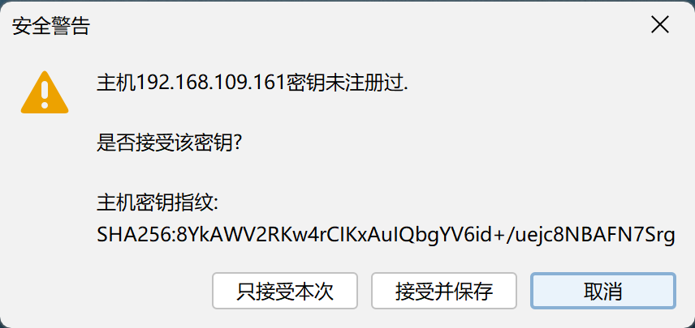
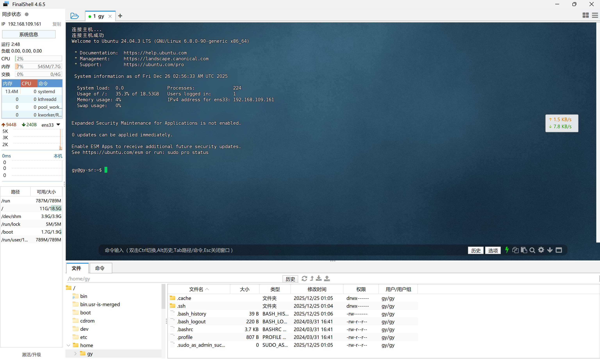
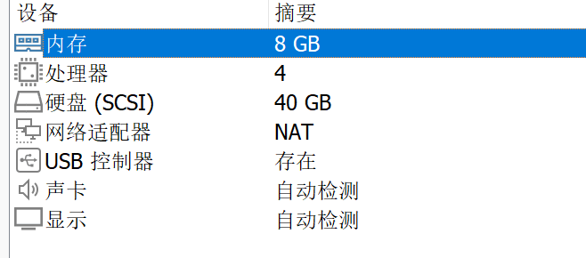

## 1 下载

[获取Ubuntu服务器版 | Ubuntu](https://cn.ubuntu.com/download/server/step1)


##  2 安装

默认往下走，第一个


选择`English`


默认不用管，选中``Done`（应该是默认），回车，至于这些界面都是什么意思，自己可以截图问豆包，后面不说就是默认继续


- 解析
  - 磁盘`/dev/sda`（40GB）被划分为 3 个分区：
    - 分区 1：BIOS 引导空间（1MB）；
    - 分区 2：`/boot`分区（2GB）；
    - 分区 3：LVM 物理卷，组成卷组`ubuntu-vg`（约 37.997G），其中已分配 18.996G 给根目录`/`，剩余 19G 为空闲空间。
  - 因为我在vmware安装界面就设置了40GB的硬盘现在看Ubuntu是默认只用20GB
  - 可能的原因是：该布局兼顾了系统引导的独立性与根目录的灵活扩展性，剩余的 LVM 空闲空间可在后续按需分配给新的分区或目录。
  - 先留着，因为我之前遇到过Kali稍微安装点儿东西就会超出20GB的情况，所以这次就多留了一些。


选择``continue`


填写基本的信息


这是Ubuntu Server 安装中的**SSH 配置界面**

- `Install OpenSSH server`：勾选后会安装 OpenSSH 服务端，实现远程安全登录（当前未勾选）；
- `Allow password authentication over SSH`：默认启用（允许通过密码进行 SSH 认证）。
- `Import SSH key`：可导入 SSH 公钥，实现免密码登录（当前无已授权密钥）。

这个看个人需求安装，我选择了安装


直接Done，后期可以再安装


开始安装


安装完成，reboot


报错


根据提示移除安装镜像


进入了登录界面，安装成功


## 3 基本设置

### 3.1 修改root密码

输入以下命令，然后再输入密码。

```bash
sudo passwd root
```



### 3.2 换源

其实安装的时候似乎Ubuntu就默认把源换成了清华源。

也可以用root账户

```bash
bash <(curl -sSL https://linuxmirrors.cn/main.sh)
```

更能确保换源效果，但是感觉打这么多字太费时间了，所以有了后面的finalshell链接方式。

### 3.3 安装

想着能够粘贴文件并且提高性能，所以安装，但是我发现似乎已经默认安装了，也不能上下滚动查看历史内容什么的，给感觉有些鸡肋，尝试用finalshell

```bash
sudo apt update  # 更新软件包列表
sudo apt upgrade # 升级软件包
sudo apt install open-vm-tools
```

### 3.4 FinalShell

#### 3.4.0 前言

为什么要使用finalshell这样的第三方shell而不是用原本Ubuntu自带的shell呢，于我而言有以下几个原因：

1. 原版shell无法复制和粘贴
2. 原版shell在vmware中使用有一定的延迟效应
3. 原版shel无法实现鼠标翻滚查看历史命令
4. finalshell挺美观的

#### 3.4.1 配置Ubuntu

1. 登录 Ubuntu 终端，更新包并安装 OpenSSH Server：

   ```bash
   sudo apt update && sudo apt install -y openssh-server
   ```

2. 启动 SSH 服务并设置开机自启：

   ```bash
   sudo systemctl start ssh
   sudo systemctl enable ssh
   ```

3. （可选）放行 SSH 端口 22（Ubuntu 默认 ufw 防火墙，若未启用可跳过）：

   ```bash
   # 查看防火墙状态
   sudo ufw status
   # 如果输出Status: active → 防火墙已启用；如果输出Status: inactive → 防火墙未启用；未启动则可跳过本步骤。
   sudo ufw allow 22/tcp
   sudo ufw reload
   ```

4. （可选）允许 root 远程登录（默认禁止）：

   ```bash
   sudo nano /etc/ssh/sshd_config
   ```
   找到`PermitRootLogin`改为`PermitRootLogin yes`（取消注释），保存后重启 SSH：

   ```bash
   sudo systemctl restart ssh
   ```

   解析：`PermitRootLogin`的**默认值是`prohibit-password`**（部分旧版本可能为`without-password`，二者含义一致）。

   这个默认值的含义是：**禁止 root 用户通过密码登录，但允许通过 SSH 密钥对的方式远程登录**。

5. 查看 SSH 状态，确认 sshd 已运行：

   ```bash
   sudo systemctl status ssh
   ps -e | grep ssh  # 出现sshd即正常
   ```

   

#### 3.4.2 连接

获取主机ip

```bash
ip addr show
```

填写FinalShell中的信息，我这里手误把109打成了108，我说怎么连接不上呢



这是FinalShell 首次连接服务器时的**SSH 主机密钥验证提示**，是 SSH 安全机制的一部分（用于确认服务器身份，防止中间人攻击）。



成了！



这样就可以愉快的复制粘贴和查看之前的命令行输出咯。

其实这才更加还原在网上租一台服务器的情形，我是为什么知道这种方法可以的呢？之前折腾我的世界服务器，根据教程，免费去腾讯云嫖了一台服务器，里面教的就是用这个finalshell，我感觉原理差不多，就是远程链接服务器，所以就类比迁移过来了，看来掌握更多的方式方法确实有很大的用处！而且这里输入东西或者移动光标什么的也没有延迟，感觉性能不错，也美观。

### 3.5 磁盘分配（vmware分配多于默认20GB时）

VMware配置



Ubuntu已分配的空间

```bash
gy@gy-utsr:~$ df -h
Filesystem                         Size  Used Avail Use% Mounted on
tmpfs                              790M  1.6M  788M   1% /run
/dev/mapper/ubuntu--vg-ubuntu--lv   19G  6.5G   12G  37% /
tmpfs                              3.9G     0  3.9G   0% /dev/shm
tmpfs                              5.0M     0  5.0M   0% /run/lock
/dev/sda2                          2.0G  100M  1.7G   6% /boot
tmpfs                              790M   12K  790M   1% /run/user/1000
```

查看 LVM 卷组的空闲空间

```bash
root@gy-utsr:~# vgdisplay
  --- Volume group ---
  VG Name               ubuntu-vg
  System ID             
  Format                lvm2
  Metadata Areas        1
  Metadata Sequence No  2
  VG Access             read/write
  VG Status             resizable
  MAX LV                0
  Cur LV                1
  Open LV               1
  Max PV                0
  Cur PV                1
  Act PV                1
  VG Size               <38.00 GiB
  PE Size               4.00 MiB
  Total PE              9727
  Alloc PE / Size       4863 / <19.00 GiB
  Free  PE / Size       4864 / 19.00 GiB	# 这一项卷组中未分配的空闲空间
  VG UUID               vGjRMu-F0C9-AOBx-mbUW-lABT-ljLr-QUIQ0a

```

接下来我们扩容根分区

```bash
# 扩展逻辑卷（将所有空闲空间分配给根分区）
sudo lvextend -l +100%FREE /dev/mapper/ubuntu--vg-ubuntu--lv
# 刷新文件系统（让系统立即识别扩容后的空间）
sudo resize2fs /dev/mapper/ubuntu--vg-ubuntu--lv
# 验证扩容结果
df -h
```

成功

```bash
root@gy-utsr:~# df -h
Filesystem                         Size  Used Avail Use% Mounted on
tmpfs                              790M  1.6M  788M   1% /run
/dev/mapper/ubuntu--vg-ubuntu--lv   38G  6.6G   29G  19% /
tmpfs                              3.9G     0  3.9G   0% /dev/shm
tmpfs                              5.0M     0  5.0M   0% /run/lock
/dev/sda2                          2.0G  100M  1.7G   6% /boot
tmpfs                              790M   12K  790M   1% /run/user/1000
```

