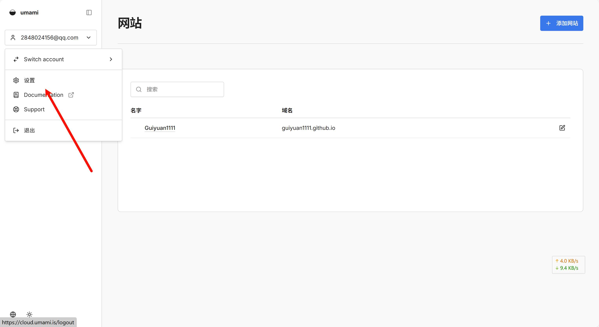
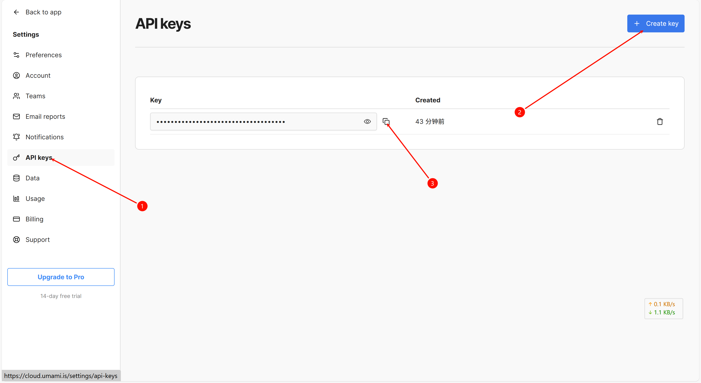
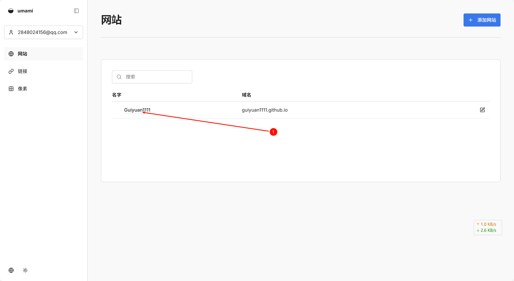
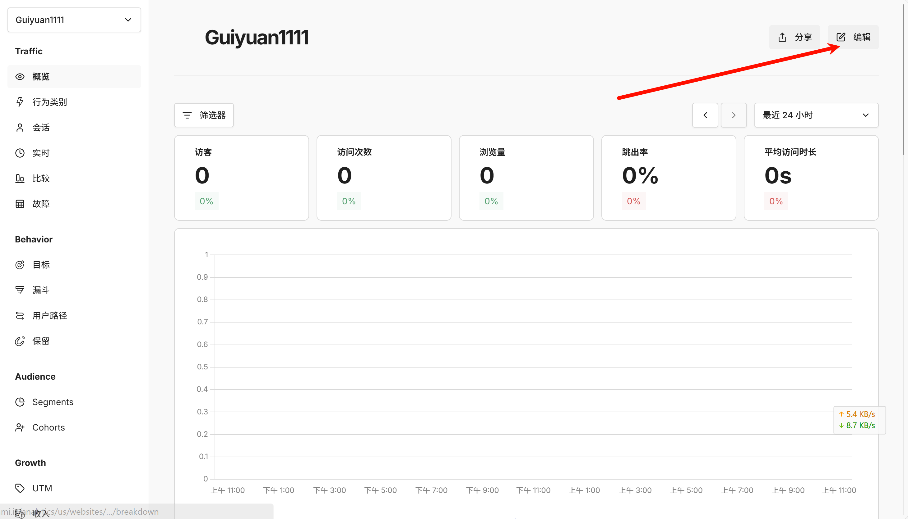
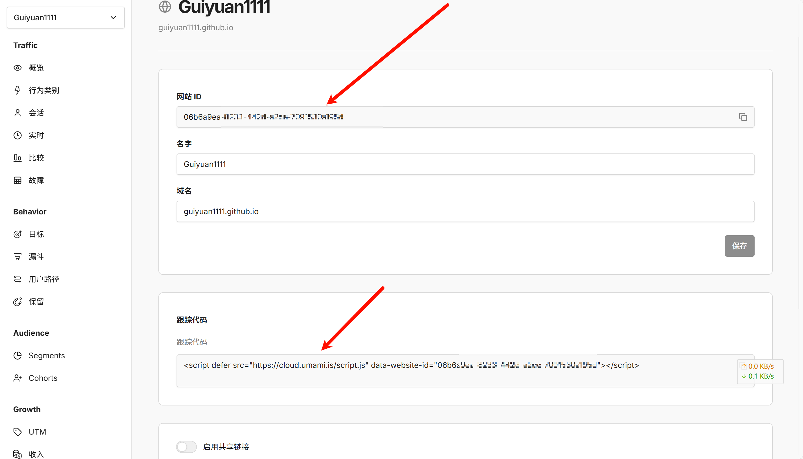
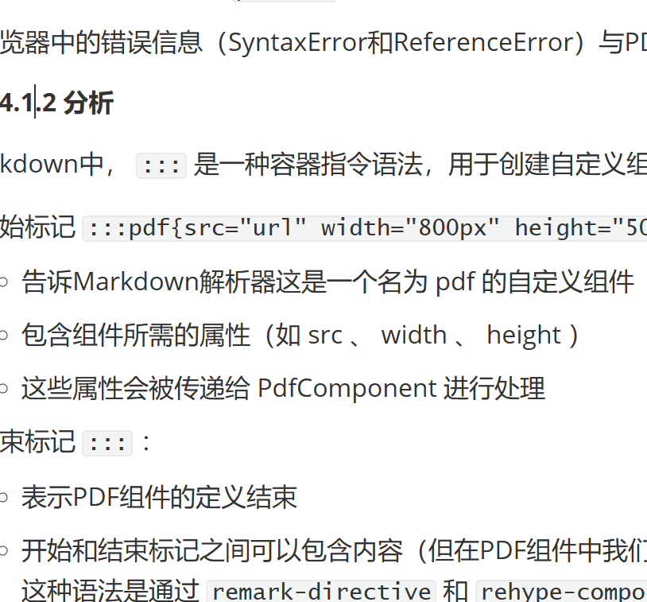

## 1 建站相关网站

### 1.1 My

[Astro](https://astro.build/)基于这个框架

[**Mizuki**](https://github.com/matsuzaka-yuki/mizuki)github库

[Mizuki教程](https://docs.mizuki.mysqil.com/)教程文档

[喵喵喵✨ - 欢迎来到我的小窝🏠](https://www.trtyr.top/)我就是看到这个网站才知道的Mizuki，这UI当时就喜欢上了！你果然还是`外观是第一生产力`。

[Cloudflare部署](https://guiyuan1111-github-io.pages.dev/)

[GitHub部署](https://guiyuan1111.github.io/)

### 1.2 其他的可能

[首页 | VuePress](https://vuepress.vuejs.org/zh/)

## 2 Mizuki相关

### 2.1 时间

#### 2.1.1 时区问题

字段`published`设置为` 2025-12-25 17:45:00`后，文章内显示正确


但是在归档的一栏显示错误


#### 2.1.2 时间字段解析


这三个字段都是依赖于`published:`字段，其他的字段注释掉也不影响，修改成别的时间也不会影响这三个的时间

### 2.2 GitHub部署

只需要按照教程里面的[配置 GitHub Action](https://docs.mizuki.mysqil.com/guide/deploy/Github/#配置-github-action)]

1. 在你的项目中的 `.github/workflows/` 目录创建一个新文件 `deploy.yml`，并粘贴以下 YAML 配置信息。

```yml
name: Deploy to GitHub Pages
on:
  # 每次推送到 `main` 分支时触发这个“工作流程”
  # 如果你使用了别的分支名，请按需将 `main` 替换成你的分支名
  push:
    branches: [ main ]
  # 允许你在 GitHub 上的 Actions 标签中手动触发此“工作流程”
  workflow_dispatch:
# 允许 job 克隆 repo 并创建一个 page deployment
permissions:
  contents: read
  pages: write
  id-token: write
jobs:
  build:
    runs-on: ubuntu-latest
    steps:
      - name: Checkout your repository using git
        uses: actions/checkout@v4
      - name: Install, build, and upload your site
        uses: withastro/action@v3
        # with:
          # path: . # 存储库中 Astro 项目的根位置。（可选）
          # node-version: 20 # 用于构建站点的特定 Node.js 版本，默认为 20。（可选）
          # package-manager: pnpm@latest # 应使用哪个 Node.js 包管理器来安装依赖项和构建站点。会根据存储库中的 lockfile 自动检测。（可选）
  deploy:
    needs: build
    runs-on: ubuntu-latest
    environment:
      name: github-pages
      url: ${{ steps.deployment.outputs.page_url }}
    steps:
      - name: Deploy to GitHub Pages
        id: deployment
        uses: actions/deploy-pages@v4
```

2. 在 GitHub 上，跳转到存储库的 Settings 选项卡并找到设置的 Pages 部分。

3. 选择 GitHub Actions 作为你网站的 Source，然后按 Save。 **小tips:** 提交前记得把workflows里的另外两个文件删了，不然action会报错喔OvO

### 2.3 Cloudflare Pages部署

按照这官网来讲就行

[Cloudflare Pages 部署 | Mizuki Next Theme](https://docs.mizuki.mysqil.com/guide/deploy/Cloudflare/)

进入界面[Home](https://dash.cloudflare.com/)

### 2.4 Umami访问量统计配置

对原本就有的文档进行一个补充，因为有部分内容过于简略，故进行一个补充

#### 2.4.1 **API 密钥** (API Key)

登陆之后找到设置





#### 2.4.2 **网站ID** (Website ID)&**跟踪脚本地址** (Tracking Script URL)







## 3 出版业

### 3.1 排版

#### 3.1.1 沿用的标准

[Markdown 教程](https://markdown.com.cn/)

#### 3.1.2 手打规范

1. 中文和英文之间会有一个空格

2. Front Matter（前置元数据），用来存储文章的元信息。

```yaml
---
title: 测试 # 标题（需更改）
published: 20xx-xx-xx   # 发表时间（需更改）
pinned: true
description: xxxxx # 描述
tags: # 标签
  - xxxxx
category: xxxxx # 分类
licenseName: Unlicensed
author: Guiyuan1111
# sourceLink: https://github.com/emn178/markdown
draft: false
date: 20xx-xx-xx
# image:./cover.png 
pubDate: 20xx-xx-xx
permalink: xx
---
```

### 3.2 编辑工具

#### 3.2.1 Typora


## 4 魔改网站

### 4.1 PDF

#### 4.1.1 创建

我需要总结完成的工作，并向用户说明PDF展示功能的使用方法。我已经成功为博客网站添加了PDF展示功能。

实现的功能：

1. 创建了PDF组件 ：
   - 文件： src/plugins/rehype-pdf-component.mjs
   - 实现了PDF文件的嵌入功能，支持自定义宽度和高度
2. 注册了PDF组件 ：
   - 在 astro.config.mjs 中导入并注册了PDF组件
   - 现在可以在Markdown中使用 :::pdf 指令来嵌入PDF文件
3. 测试了功能 ：
   - 在 src/content/posts/gypost/测试.md 中添加了PDF测试用例
   - 使用了在线PDF文件和本地PDF文件进行测试
   - 将本地PDF文件放在 public/files/ 目录下，路径为 /files/The_Year_Gone,_and_The_Year_Ahead.pdf
     使用方法：

在博客文章中使用以下语法嵌入PDF文件：

```markdown
:::pdf{src="https://example.com/file.pdf" 
width="800px" height="500px"}
:::
```

或者使用本地文件：

```markdown
:::pdf{src="/files/file.pdf"}
:::
```

参数说明：

- src ：PDF文件的URL或相对路径（必填）
- width ：PDF嵌入框的宽度（可选，默认为100%）
- height ：PDF嵌入框的高度（可选，默认为600px）

注意事项：

- 本地PDF文件需要放在 `public/` 目录下才能被正确访问
- 浏览器中的错误信息（SyntaxError和ReferenceError）与PDF展示功能无关，不影响PDF的正常显示

#### 4.1.2 分析

在Markdown中， `:::` 是一种容器指令语法，用于创建自定义组件。在我们的PDF展示功能中：

1. 开始标记 `:::pdf{src="url" width="800px" height="500px"}` ：
   - 告诉Markdown解析器这是一个名为 pdf 的自定义组件
   - 包含组件所需的属性（如 src 、 width 、 height ）
   - 这些属性会被传递给 PdfComponent 进行处理
2. 结束标记 `:::` ：
   - 表示PDF组件的定义结束
   - 开始和结束标记之间可以包含内容（但在PDF组件中我们没有使用子内容）
     这种语法是通过 `remark-directive` 和 `rehype-components` 插件实现的，允许我们在Markdown中轻松使用自定义组件，就像使用普通Markdown语法一样。它使我们能够扩展Markdown的功能，添加PDF嵌入、GitHub卡片、警告框等自定义内容。



### 4.2 文内连接

尝试使用基于网站根目录的跳转，但是遇到了Typora内可用，但是遇到了mizuki无法解析含空格的路径问题


我让ai改了半天也没成功，后来想到，即使标题含着空格，但是在一篇文章还是可以跳转，那我们是不是可以直接借鉴这个思路？


原来是默认把` `转为`-`了，直接截取`/posts/gypost/git/#1-git命令`部分，果然成功了！
